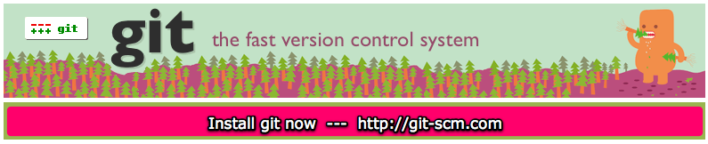

!SLIDE bullets center
# Contributing to OSS - The 8 Steps for Fixing Other People’s Code #

* Dr Nic, @drnic, drnicwilliams.com
* Mocra, mocra.com

!SLIDE bullets center
# Meta #

* self     = http://oss8steps.heroku.com
* twitter  = #oss8steps
* pre-reqs = git, rubygems
* OSS      = "Open Source Software"

!SLIDE bullets
# Aim for today #

* Learn the 8 steps
* Fix a project
* Create and receive fixes
* Best tools for everything
* Make some friends

!SLIDE bullets
# Who am I? #

* Since RailsConf 2006
* 100+ tiny-to-small-to-medium OSS projects
* 50+ contributions to other OSS
* github.com/drnic

!SLIDE bullets
# What do I make? #

* Tools
* TextMate bundles
* Little things
* 1st drafts of things

!SLIDE bullets
# Help or recreate? #

* Help an existing project?
* Or rewrite it

!SLIDE bullets
# Help someone else? #

* Nice to have your name as author
* Less responsibility as contributor
* Visibility of contribution via blogs, announcements
* Make friends; conferences have purpose

!SLIDE bullets
# Recreate existing project? #

* Capybara recreation of Webrat
* Merb recreation of Rails
* Brand/community confusion
* But fix fundamental flaws

!SLIDE bullets
# OSS project team? #

* Are contributors a "team"?
* Opportunity to express individuality
* You add/fix/document what you want

