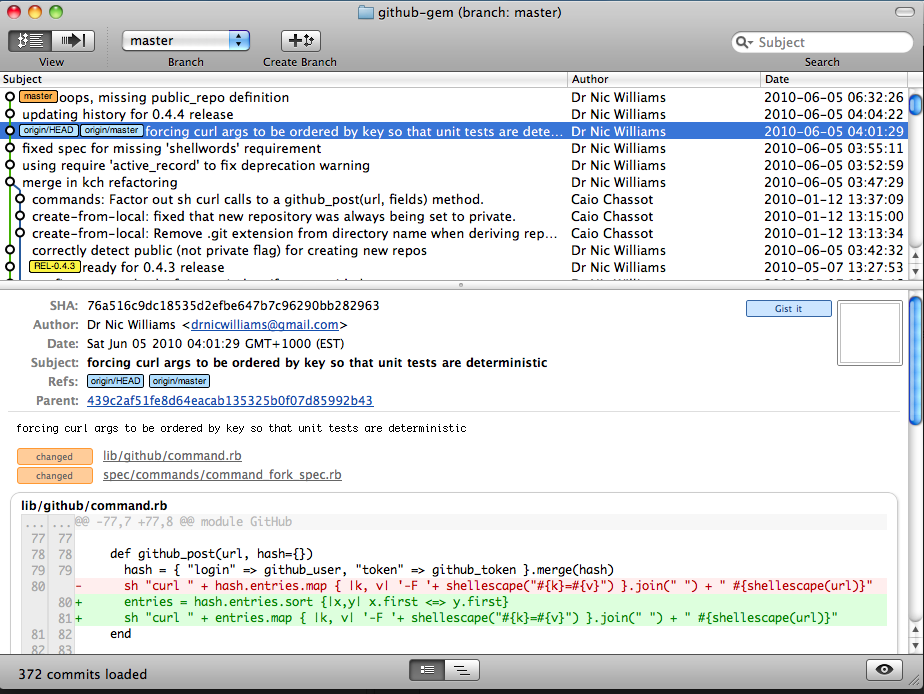
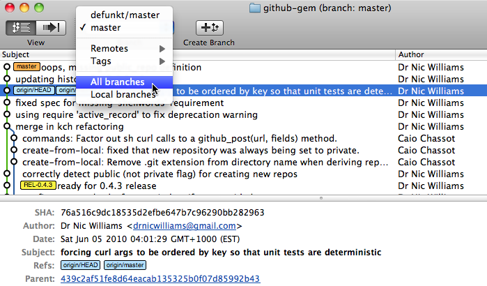

!SLIDE bullets
# Receiving Patches #

* The best part of Open Source?
* Some good patches
* Some bad patches
* Notification via email
* Examine via git

!SLIDE commandline incremental
# Examining Patches #

    $ gh network -h
    You have to provide a command :
        list           - shows the projects in your network
        fetch          - adds all projects in your network as remotes and fetches
        commits        - lists all commits in your network to be merged

    $ gh network fetch
    $ gitx

!SLIDE full-page

!SLIDE center
# Show all branches #

