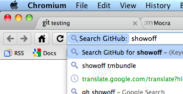
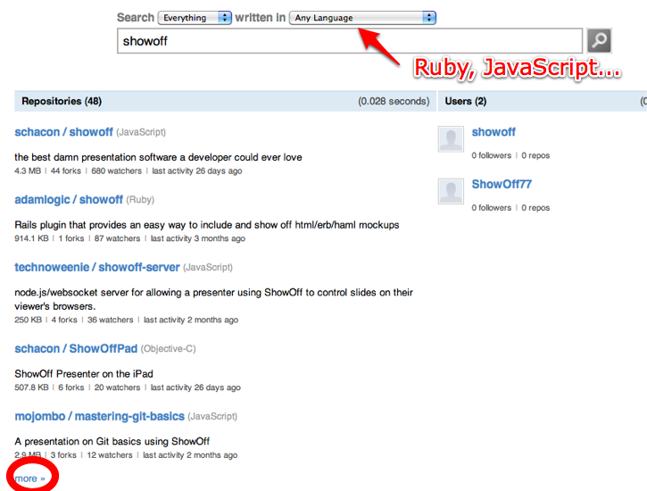
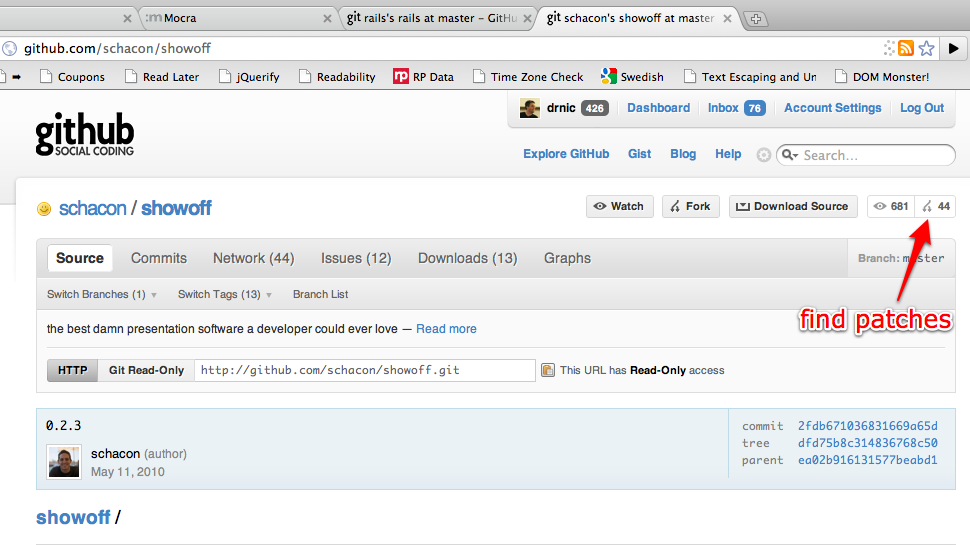
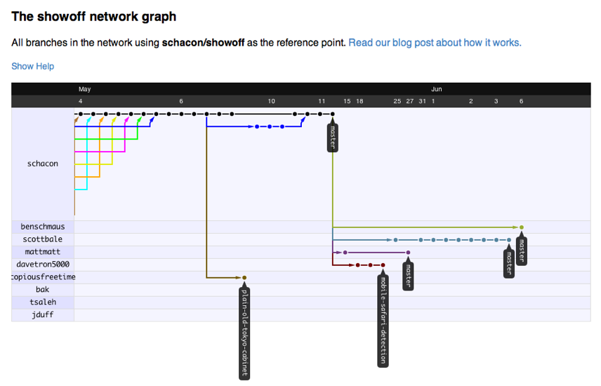
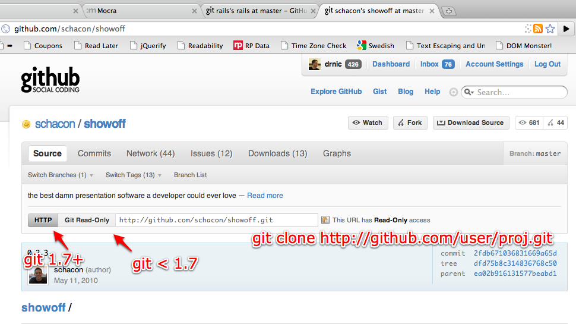
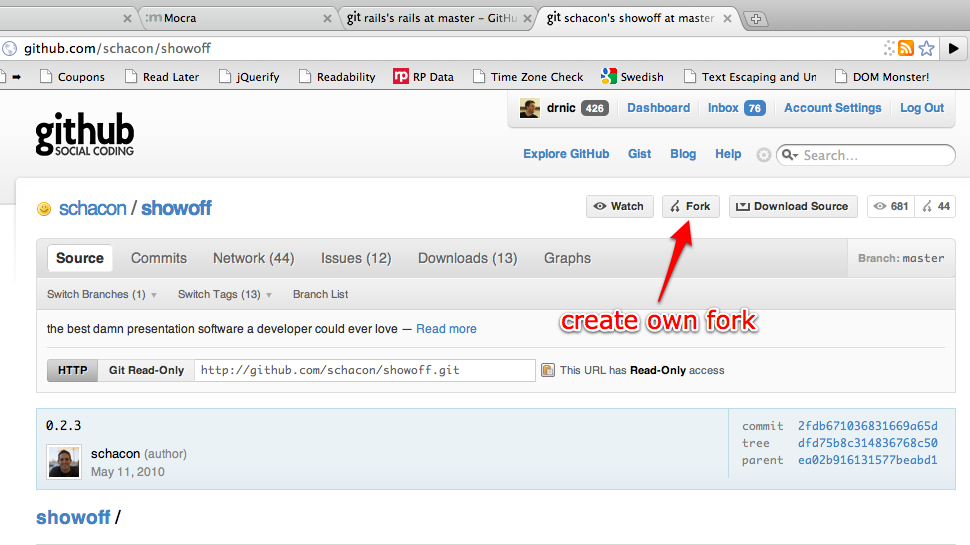
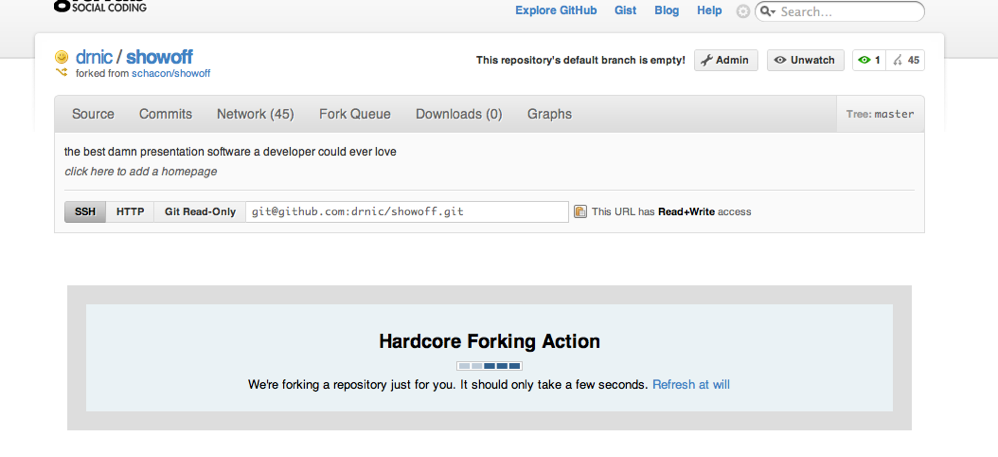
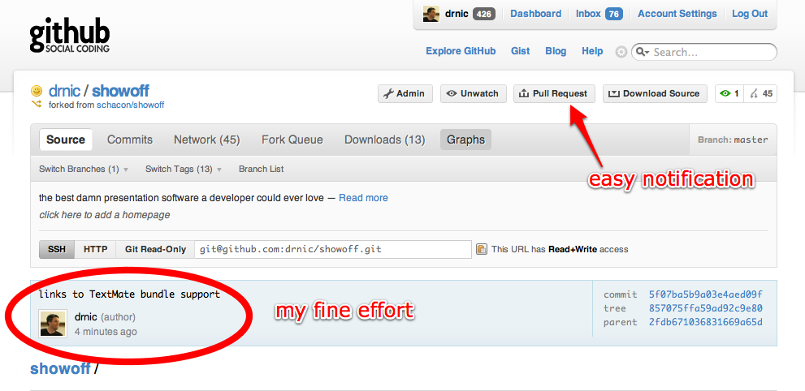
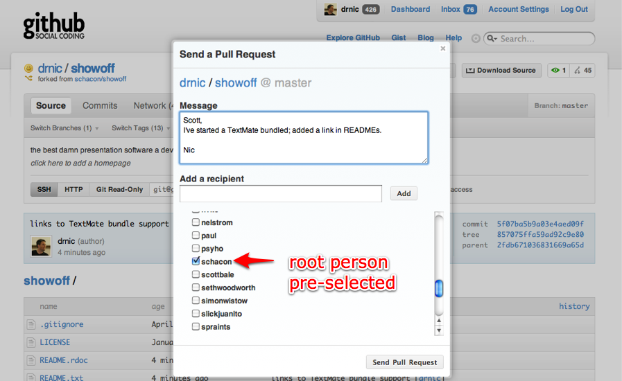

!SLIDE bullets center
# 1. Get annoyed by a defect or missing feature #

* Personal Power - Tony Robbins
* Circle of Concern vs Circle of Influence - 7 Habits of Highly Effective People

!SLIDE full-page

!SLIDE center
# 2. Find the source. #

!SLIDE center
# Managing search in Chrome #

!SLIDE center
# 2a. Find the source. #

!SLIDE center
# 2b. Anyone else fixed it? #

!SLIDE center
# 2b. Anyone else fixed it? #

!SLIDE center
# 3. Checkout the source #

!SLIDE commandline
# 4. Snoop around #

    $ git clone http://github.com/schacon/showoff.git
    Initialized empty Git repository in /Users/drnic/Documents/ruby/gems/showoff/.git/
    ...
    Resolving deltas: 100% (587/587), done.
    
    $ cd showoff
    $ rake -T
    rake clean                      # Remove any temporary products.
    rake gem                        # Build gem into dist/
    rake gem:install                # Build and install as local gem
    rake gem:publish                # Push the gem to RubyGems.org
    rake package                    # Build gem and tarball into dist/
    $ ls
    LICENSE       README.txt  TODO.txt   example  public  showoff.gemspec
    README.rdoc   Rakefile    bin        lib      script  views
    
    # NO TESTS?!

!SLIDE commandline
# 4. Snoop around; Try #2 #

    $ git clone http://github.com/wycats/thor.git
    $ cd thor
    $ rake -T
    No Rakefile found (looking for: rakefile, Rakefile, rakefile.rb, Rakefile.rb)
    $ sudo gem install thor
    $ thor list
    default
    -------
    thor :build               # Build gem
    thor :install             # Install gem using sudo
    thor :spec                # Run specs
    ...
    $ thor :spec
    ....................................................
    498 examples, 0 failures

!SLIDE bullets
# 5. Make changes #

* Add coverage tests
* Add break tests
* Add documentation
* Cleanup/refactor
* Add features

!SLIDE commandline
# 5a. Make changes via git #

    $ git status
    # On branch master
    # ...
    #	modified:   README.rdoc
    #	modified:   README.txt
    
    $ git commit -a -m "links to TextMate bundle support"
    [master 52a7198] links to TextMate bundle support
     2 files changed, 12 insertions(+), 1 deletions(-)
    

!SLIDE center
# 6. Fork repository #

!SLIDE center
# 6. Fork repository #

!SLIDE commandline
# 7. Push changes #

    $ git remote rename origin schacon
    $ git remote add origin git@github.com:drnic/showoff.git
    $ git push origin master
    Counting objects: 7, done.
    Delta compression using up to 2 threads.
    Compressing objects: 100% (4/4), done.
    Writing objects: 100% (4/4), 578 bytes, done.
    Total 4 (delta 3), reused 0 (delta 0)
    To git@github.com:drnic/showoff.git
       2fdb671..5f07ba5  master -> master

!SLIDE center
# 8. Announce changes #

!SLIDE center
# 8. Announce changes #

