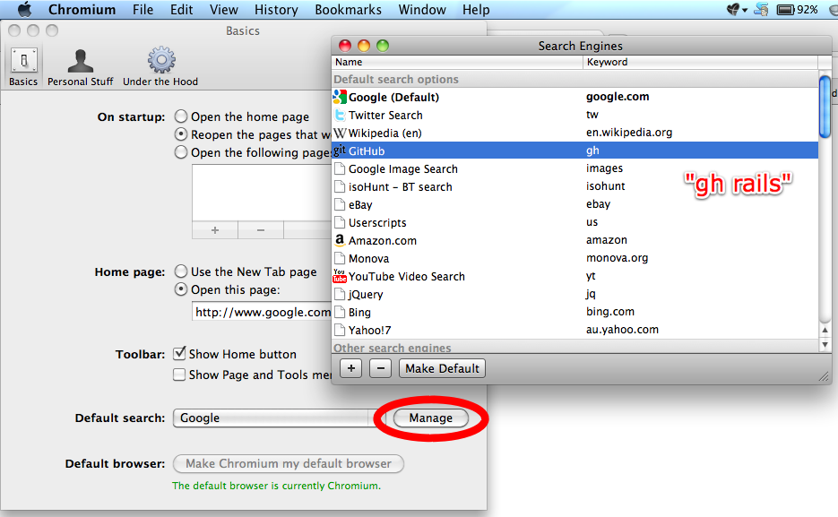

!SLIDE bullets
# 1. Get annoyed by a defect or missing feature #

* Personal Power - Tony Robbins
* Circle of Influence - 7 Habits of Highly Effective People
* The power to change and ability to accept the things we can't

!SLIDE center
# 2. Find the source. Anyone else fixed it? #

!SLIDE bullets
# 3. Checkout the source #



!SLIDE bullets
# 4. Snoop around #



!SLIDE bullets
# 5. Make changes #



!SLIDE bullets
# 6. Fork repository #



!SLIDE bullets
# 7. Push changes #



!SLIDE bullets
# 8. Announce changes #



