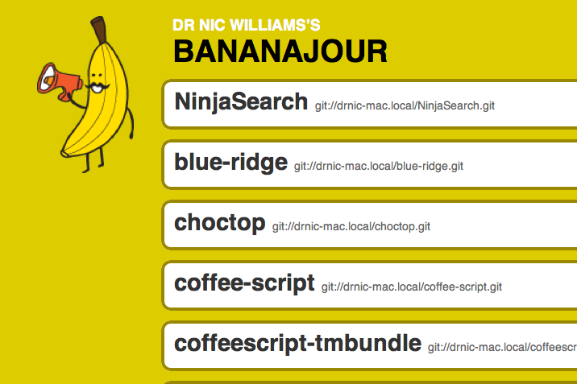

!SLIDE bullets
# Bananajour #

* Host git repos from laptop
* Discover git repos
* Via Bonjour

!SLIDE commandline
# Bananajour #

    $ gem install bananajour
    $ cd oss-8steps-app
    $ bananajour add ../oss-8steps-app
    Project Name? [oss-8steps-app]
    Bananajour repository oss-8steps-app.git initialised and remote banana added.
    Next: git push banana master
    $ git push banana master

!SLIDE commandline
# Bananajour Server #

    $ bananajour
    * Starting http://drnic-mac.local:9331/
    * Starting git://drnic-mac.local/
    Registering http://drnic-mac.local:9331/
    Registering git://drnic-mac.local/oss-8steps-app.git
    == Sinatra/0.9.4 has taken the stage on 9331 for production with backup from Thin
    >> Thin web server (v1.2.7 codename No Hup)
    >> Maximum connections set to 1024
    >> Listening on 0.0.0.0:9331, CTRL+C to stop

!SLIDE center
# Bananajour Browser #

!SLIDE bullets
# Bananajour Discovery #

* Can find other "bananas"
* Visit other's repo sharing page
* No push support

