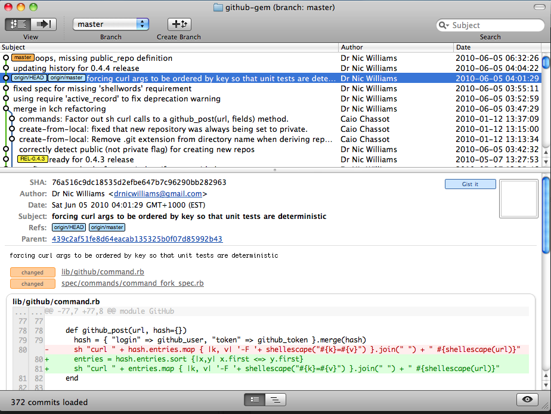
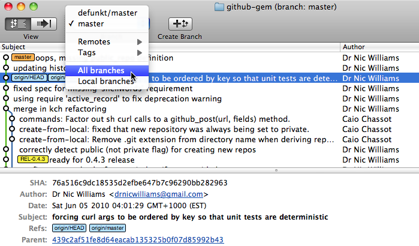
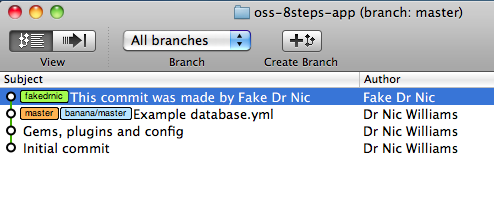

!SLIDE bullets
# Merge someone's patches #

* The best part of Open Source?
* Some good patches
* Some bad patches
* Notification via email
* Examine via git

!SLIDE commandline
# Examining patches #

    $ gh network -h
    You have to provide a command :
        list           - shows the projects in your network
        fetch          - adds all projects in your network as remotes and fetches
        commits        - lists all commits in your network to be merged

    $ gh network fetch
    $ gitx

!SLIDE full-page

!SLIDE center
# Show all branches #

!SLIDE commandline
# Merge entire fork #

    $ gh pull --merge bjeanes
    
    $ gh pull bjeanes
    $ git merge bjeanes/master

!SLIDE commandline
# Merge commits fork #

    $ gh pull bjeanes
    $ git cherry-pick --signoff <commit-ish>

!SLIDE center
# Example signoff #

!SLIDE commandline
# Example signoff #

    $ git cherry-pick --signoff 88a3b68
    Finished one cherry-pick.
    [master b507afd] This commit was made by Fake Dr Nic
     Author: Fake Dr Nic <drnicwilliams@gmail.com>
     2 files changed, 2 insertions(+), 2 deletions(-)
     delete mode 100644 app/views/home/index.html.erb
     create mode 100644 app/views/home/index.html.haml

!SLIDE commandline
# Sign-off-by #

    $ git log
    commit b507afd077d6a6f3a56f617dc944e1a7e6df8956
    Author: Fake Dr Nic <drnicwilliams@gmail.com>
    Date:   Sun Jun 6 07:35:30 2010 -0400

        This commit was made by Fake Dr Nic

        Signed-off-by: Dr Nic Williams <drnicwilliams@gmail.com>

